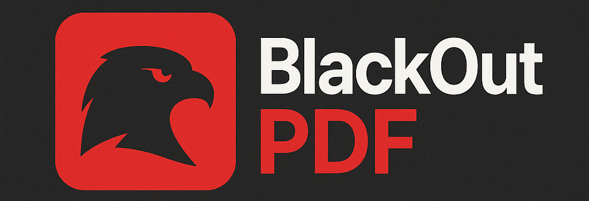

# BlackOutPDF


**The Revolutionary PDF Redaction Tool with Advanced RSA Content Protection**

BlackOutPDF introduces a groundbreaking approach to document security: **RSA Content Encryption**. Unlike traditional tools that simply password-protect PDFs, BlackOutPDF encrypts the actual redacted content itself, allowing universal document access while restricting content restoration to authorized users only.

## 🚀 Revolutionary Features

### **RSA Content Encryption Technology**
- **🔓 Universal Access**: Anyone can open and read the redacted PDF
- **🔐 Selective Restoration**: Only private key holders can un-redact content
- **🎯 Content-Level Security**: Encrypts redaction data, not document access
- **📋 Perfect Reconstruction**: Ultra-precise restoration to original state

### **Advanced Redaction Tools**
- **📐 Multiple Shapes**: Rectangles, polygons, freehand drawing
- **🎨 Visual Interface**: Intuitive Qt5-based GUI with real-time preview
- **⚡ Smart Selection**: Intelligent area detection and selection
- **🔄 Reversible Process**: Complete content preservation with encryption

### **Professional Security**
- **🔑 RSA Key Management**: Generate, import, and manage RSA key pairs
- **🛡️ Hybrid Encryption**: RSA + AES for optimal security and performance
- **📊 Integrity Verification**: SHA256 checksums ensure data integrity
- **🔒 Hidden Storage**: Encrypted data stored in invisible PDF annotations

## 🎯 Why Choose BlackOutPDF?

### **Traditional Redaction Problems Solved**
- ❌ **Standard tools**: Permanent content destruction
- ❌ **Password protection**: All-or-nothing access control
- ❌ **Manual processes**: Time-consuming and error-prone

### **BlackOutPDF Advantages**
- ✅ **Reversible redaction**: Original content preserved and encrypted
- ✅ **Granular control**: Individual content restoration by authorized users
- ✅ **Future-proof**: Content remains accessible to key holders indefinitely
- ✅ **Professional grade**: Enterprise-level security with user-friendly interface

## 🔧 Technical Excellence

### **Ultra-Precise Content Capture**
- **3x Resolution Pixmaps**: High-fidelity visual backup
- **Element-Level Extraction**: Text, images, vectors, annotations
- **Multi-Method Restoration**: Primary + fallback reconstruction algorithms
- **Surgical Precision**: Exact positioning and formatting preservation

### **Robust Architecture**
- **PyMuPDF Integration**: Professional PDF manipulation
- **Cryptography Library**: Industry-standard encryption
- **Multi-threaded Processing**: Responsive UI during operations
- **Error Recovery**: Comprehensive validation and integrity checks

## 🚀 Quick Start Guide

### Installation
```bash
# Clone or download BlackOutPDF
cd BlackOutPDF2

# Install dependencies
pip install -r requirements.txt

# Launch application
python main.py
```

### Basic Workflow
1. **📁 Load Document**: Open your PDF file
2. **🔑 Generate Keys**: Create RSA key pair or import existing keys
3. **✏️ Mark Areas**: Select content to redact using drawing tools
4. **🔐 Export Encrypted**: Save with RSA public key encryption
5. **📤 Distribute**: Share redacted PDF - anyone can read it
6. **🔓 Restore Content**: Use private key to decrypt and restore original content

### Advanced Usage
```bash
# Custom configuration
edit blackout_pdf_config.json

# Different redaction modes
- Rectangle selection
- Polygon drawing
- Freehand marking

# Security options
- Key size: 2048-4096 bits
- Custom encryption parameters
- Batch processing support
```

## 🛡️ Security Specifications

### **Encryption Standards**
- **RSA Key Sizes**: 2048, 3072, 4096 bits
- **Symmetric Encryption**: AES-256-GCM
- **Hash Functions**: SHA-256, MD5 verification
- **Key Derivation**: PBKDF2 with random salts

### **Data Protection**
- **Content Isolation**: Redacted areas completely destroyed in visible layer
- **Encrypted Storage**: Original content encrypted with hybrid RSA+AES
- **Integrity Verification**: Multiple checksum validation layers
- **Secure Cleanup**: Temporary data securely wiped after operations

## 🎮 User Interface

### **Intuitive Design**
- **📱 Modern GUI**: Clean, professional Qt5 interface
- **🖱️ Interactive Canvas**: Real-time redaction preview
- **⚙️ Customizable Settings**: Themes, shortcuts, default behaviors
- **📊 Progress Tracking**: Visual feedback for all operations

### **Professional Tools**
- **🔍 Zoom Controls**: Precise area selection at any magnification
- **📏 Measurement Tools**: Exact positioning and sizing
- **🎨 Visual Feedback**: Color-coded selection and preview modes
- **⌨️ Keyboard Shortcuts**: Efficient workflow acceleration

## 📋 System Requirements

### **Minimum Requirements**
- **OS**: Windows 10+, macOS 10.14+, Linux (Ubuntu 18.04+)
- **Python**: 3.7 or higher
- **RAM**: 4GB minimum (8GB recommended)
- **Storage**: 100MB free space

### **Dependencies**
- **PyQt5**: Modern GUI framework
- **PyMuPDF**: Professional PDF processing
- **Cryptography**: Military-grade encryption
- **Pillow**: Advanced image processing
- **NumPy**: High-performance data operations

## 🔬 Technical Innovation

BlackOutPDF represents a paradigm shift in document security. By separating **document access** from **content restoration**, it enables new use cases:

- **Legal Discovery**: Distribute documents with selective disclosure rights
- **Medical Records**: Share reports with patient-controlled content access
- **Corporate Security**: Hierarchical document access with content-level permissions
- **Government Applications**: Classified content with need-to-know restoration

## 📞 Support & Development

BlackOutPDF is actively developed with focus on security, usability, and innovation. The codebase demonstrates advanced Python techniques including:

- **Cryptographic Programming**: Secure key management and hybrid encryption
- **PDF Manipulation**: Low-level document structure modification
- **GUI Development**: Professional desktop application design
- **Security Engineering**: Defense-in-depth content protection

---

**🔐 BlackOutPDF - Redefining Document Security Through Innovation**


